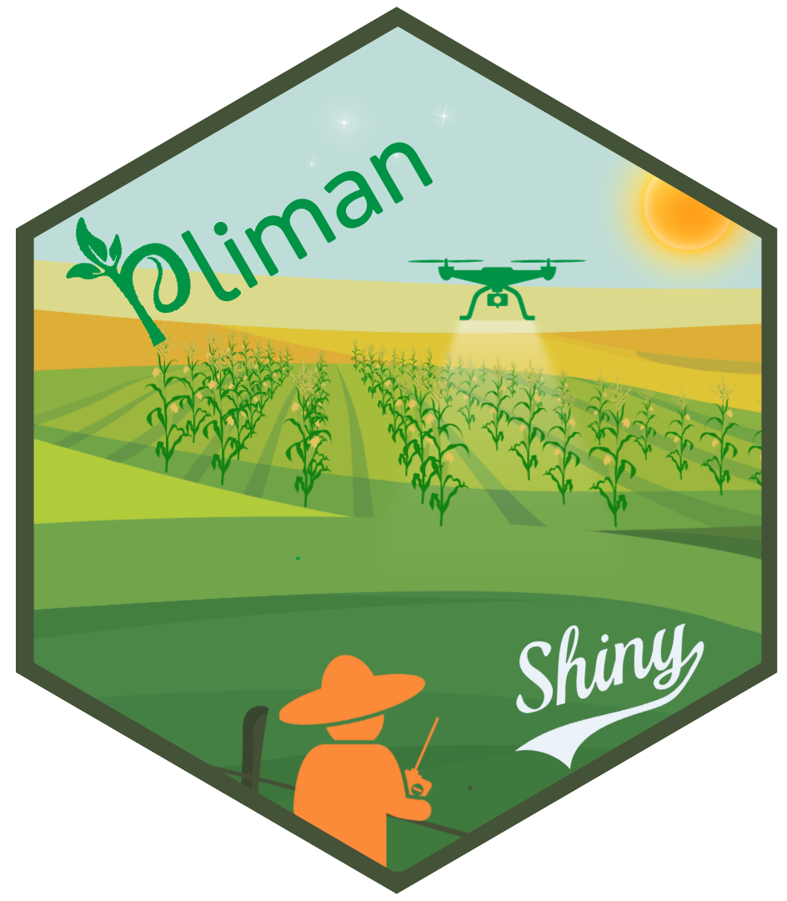

<!-- README.md is generated from README.Rmd. Please edit that file -->

# plimanshiny 

## Menu

<!-- badges: start -->

[](https://lifecycle.r-lib.org/articles/stages.html#experimental)
[](https://zenodo.org/doi/10.5281/zenodo.10476816)


<!-- badges: end -->

The goal of plimanshiny is to provide a Shiny interface for the pliman
package

## Installation

The development version of `plimanshiny` can be installed from
[GitHub](https://github.com/TiagoOlivoto/plimanshiny) using the
[pak](https://github.com/r-lib/pak) package:

``` r
install.packages("pak")
pak::pkg_install("NEPEM-UFSC/pliman")
pak::pkg_install("NEPEM-UFSC/plimanshiny")
```

*Note*: If you are a Windows user, you should also first download and
install the latest version of
[Rtools](https://cran.r-project.org/bin/windows/Rtools/).

To start using plimanshiny, you need to load the package and call the
app with `run_app()`.

``` r
library(plimanshiny)
run_app()
```

The app will initiate and display the following home screen.


